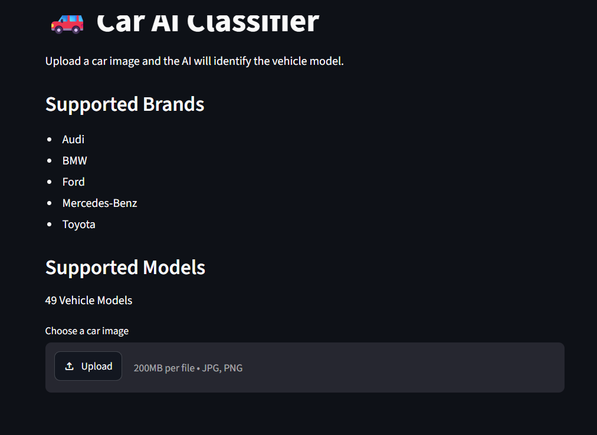
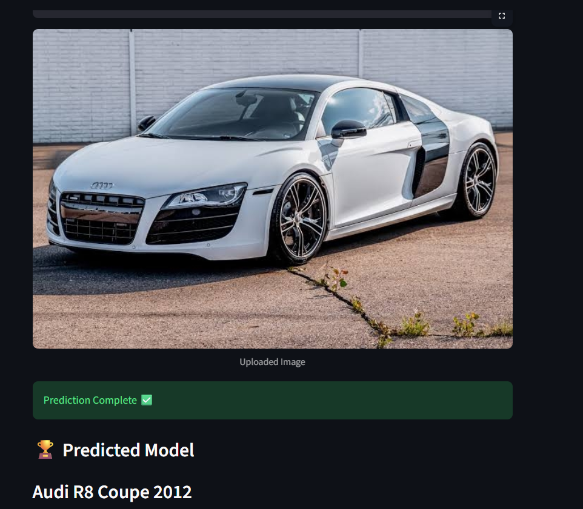
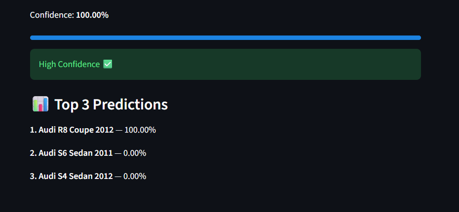

# 🚗 Car AI Classifier

A Deep Learning project that identifies vehicle models from images using **PyTorch**, **EfficientNet-B0**, and **Streamlit**.

The project uses **transfer learning** to first learn general car brand features and then fine-tunes the model to classify **49 specific vehicle models**.

---

# Features

- 🚗 Vehicle Model Classification
- 🧠 Transfer Learning with EfficientNet-B0
- 📈 Top-3 Predictions
- 🎯 Confidence Score
- 🌐 Interactive Streamlit Web App
- ⚡ GPU Training with CUDA Support

---

# Supported Brands

- Audi
- BMW
- Ford
- Mercedes-Benz
- Toyota

---

# Supported Vehicle Models

The model can classify **49 different vehicle models**, including examples such as:

- Audi R8 Coupe 2012
- Audi TT RS Coupe 2012
- BMW M3 Coupe 2012
- BMW X5 SUV 2007
- Ford Mustang Convertible 2007
- Ford F-150 Regular Cab 2012
- Mercedes-Benz C-Class Sedan 2012
- Mercedes-Benz E-Class Sedan 2012
- Toyota Camry Sedan 2012
- Toyota Corolla Sedan 2012

---

# Model Architecture

- EfficientNet-B0
- Transfer Learning
- PyTorch
- Adamax Optimizer
- CrossEntropy Loss
- Learning Rate Scheduler

---

# Training Pipeline

### Phase 1 — Brand Classification

The model was initially trained on a car brand classification dataset to learn general vehicle features.

**Dataset**

https://www.kaggle.com/datasets/ahmedelsany/car-brand-classification-dataset

Result:

- **33 Brands**
- **75.76% Validation Accuracy**

---

### Phase 2 — Vehicle Model Classification

The pretrained brand classifier was then fine-tuned on the Stanford Cars Dataset to classify individual vehicle models.

**Dataset**

https://www.kaggle.com/datasets/jutrera/stanford-car-dataset-by-classes-folder

Result:

- **49 Vehicle Models**
- **87.54% Validation Accuracy**

---

# Screenshots

## Home



---

## Prediction



---

## Results



---

# Installation

Clone the repository:

```bash
git clone https://github.com/YOUR_USERNAME/Car-AI-Classifier.git
```

Install the dependencies:

```bash
pip install -r requirements.txt
```

Run the application:

```bash
streamlit run src/app.py
```

---

# Project Structure

```
Car-AI-Classifier/
│
├── src/
│   ├── app.py
│   ├── train.py
│   └── predict.py
│
├── screenshots/
│   ├── home.png
│   ├── prediction.png
│   └── results.png
│
├── requirements.txt
├── .gitignore
└── README.md
```

---

# Technologies Used

- Python
- PyTorch
- TorchVision
- Streamlit
- Pillow

---

# Future Improvements

- Add more vehicle brands.
- Support newer vehicle models.
- Deploy the application online.
- Improve accuracy using EfficientNet-B2/B3 or ConvNeXt.
- Add brand detection before model prediction.

---

# Author

**Ziyad Chihani**

Deep Learning & Computer Vision Project
